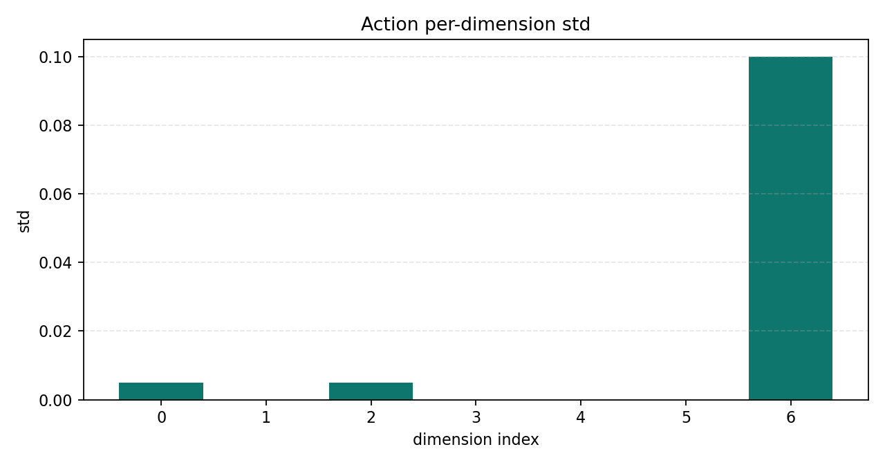
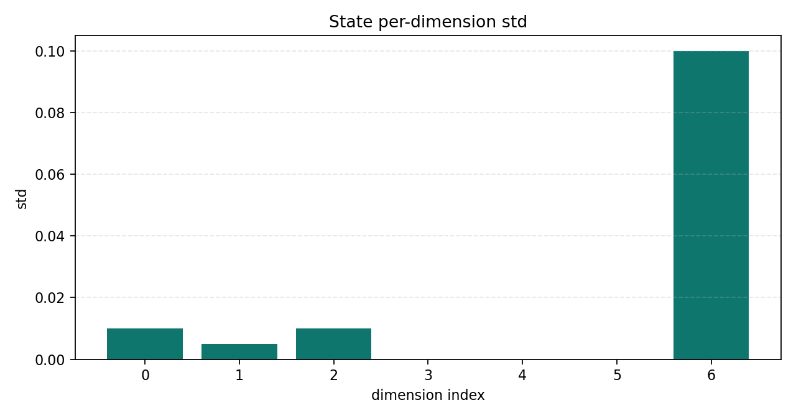

# Robot Data Quality Pipeline Report

## 1. Overview

| Item | Value |
| --- | --- |
| Input | `scripts\bridge_mock_episodes.jsonl` |
| Dataset | `bridge` |
| Profile | `configs\bridge_v2_profile.json` |
| Episodes | 1 |
| Steps | 2 |
| Issue count | 0 |

## 2. Expected Schema

| Rule | Value |
| --- | --- |
| expected_action_dim | 7 |
| expected_state_dim | 7 |
| expected_image_shape | 256x256x3 |
| min_trajectory_length | 2 |
| max_trajectory_length | 200 |
| action_abs_limit | 1.0 |
| primary_image_field | `steps/observation/image_0` |
| unified_image_field | `steps/observation/image` |

## 3. Quality Summary

### Issue Types

No issue types were found.

### Quality Rates

No missing-field quality rate issues were found.

## 4. Action Distribution

| dim | min | max | mean | std |
| --- | --- | --- | --- | --- |
| 0 | 0.01 | 0.02 | 0.015 | 0.005 |
| 1 | 0.0 | 0.0 | 0.0 | 0.0 |
| 2 | 0.01 | 0.02 | 0.015 | 0.005 |
| 3 | 0.0 | 0.0 | 0.0 | 0.0 |
| 4 | 0.0 | 0.0 | 0.0 | 0.0 |
| 5 | 0.01 | 0.01 | 0.01 | 0.0 |
| 6 | 0.8 | 1.0 | 0.9 | 0.1 |

## 5. State Distribution

| dim | min | max | mean | std |
| --- | --- | --- | --- | --- |
| 0 | 0.1 | 0.12 | 0.11 | 0.01 |
| 1 | 0.2 | 0.21 | 0.205 | 0.005 |
| 2 | 0.3 | 0.32 | 0.31 | 0.01 |
| 3 | 0.0 | 0.0 | 0.0 | 0.0 |
| 4 | 0.0 | 0.0 | 0.0 | 0.0 |
| 5 | 0.1 | 0.1 | 0.1 | 0.0 |
| 6 | 0.8 | 1.0 | 0.9 | 0.1 |

## 6. Plots

## 7. Engineering Notes

- This report is generated from pipeline artifacts, not written manually.
- The profile records dataset-specific schema rules.
- The manifest records input, configuration, JSON summaries, and plot paths for reproducibility.
