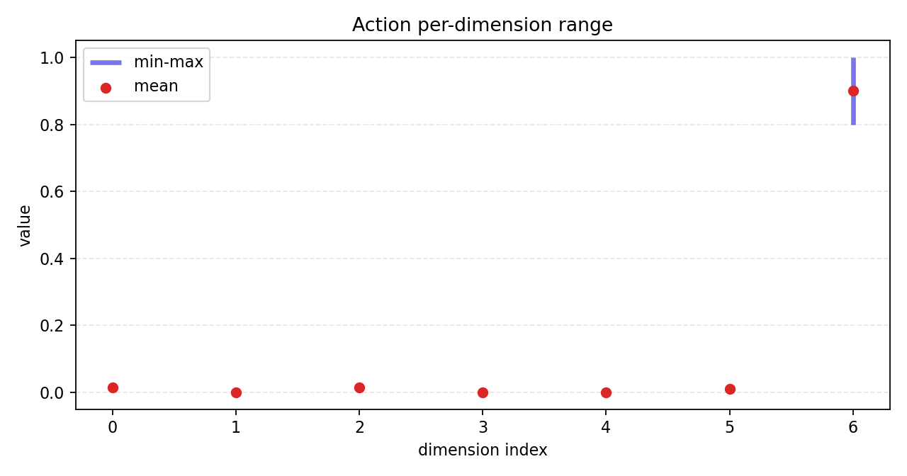
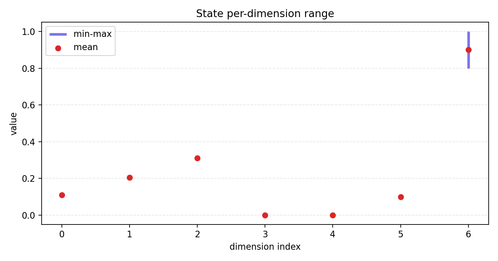

# Day 7 Action / State 分布可视化报告

## 1. 目标

Day 7 将 action / state 分布统计结果转成图表，方便更直观地观察每一维的数值范围和波动情况。

## 2. 运行命令

```powershell
python scripts\plot_distribution.py --input reports\bridge_mock_distribution_summary.json --output-dir assets\distributions
```

生成图表：

- `assets/distributions/action_range.png`
- `assets/distributions/action_std.png`
- `assets/distributions/state_range.png`
- `assets/distributions/state_std.png`

## 3. Action Range



该图展示 action 每一维的 min-max 范围和 mean。当前 mock 数据中，第 6 维变化最明显，范围为 0.8 到 1.0，mean 为 0.9。

## 4. Action Std


该图展示 action 每一维的 std。第 6 维 std 最大，说明它在当前样例中变化最明显。部分维度 std 为 0，说明当前样本中这些维度没有变化。

## 5. State Range



该图展示 state 每一维的 min-max 范围和 mean。当前 mock 数据中，第 0、1、2、6 维存在变化。

## 6. State Std


该图展示 state 每一维的 std。第 6 维波动最大，其余部分维度波动较小或为 0。

## 7. 工程意义

分布可视化可以帮助发现纯 JSON 统计不容易直观看到的问题：

- 某一维 action 是否出现极端值。
- 某一维 action / state 是否长期不变。
- action 和 state 是否存在异常范围。
- 数据是否需要归一化、裁剪或进一步清洗。

面试表达：

> Day 7 我把 action/state 分布统计可视化，生成每一维的 range 和 std 图。这样可以直观看到哪些维度变化明显，哪些维度几乎不变。对于机器人数据来说，维度正确只是第一步，分布是否合理同样重要，因为异常范围或长期不变的维度都可能影响模仿学习训练。
